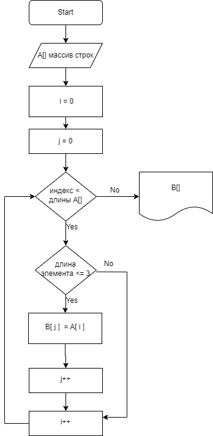

## Условие задачи
Написать программу, которая из имеющегося массива строк формирует массив из строк, длина которых меньше или равна 3 символа.
## Блок-схема алгоритма решения задачи

## Программа, решающая задачу
~~~
int n;
Console.WriteLine("Задайте количество элементов:");
n = int.Parse(Console.ReadLine());
string[] array = new string[n];

for (int i = 0; i < n; i++)
{
    Console.WriteLine("Задайте строку:");
    array[i] = Console.ReadLine();
}

void PrintArray(string[] arr)
{
    Console.Write("[");
    for (int i = 0; i < arr.Length - 1; i++)
    {
        Console.Write("'" + arr[i] + "', ");
    }
    if (arr.Length > 0)
    {
        Console.Write("'" + arr[arr.Length - 1] + "'");
    }
    Console.Write("]");
}

PrintArray(array);

Console.Write(" -> ");

int A(string[] ar)
{
    int k = 0;
    for (int i = 0; i < ar.Length; i++)
    {
        if (ar[i].Length <= 3)
        {
            k++;
        }

    }
    return k;

}
int g = A(array);

string[] newArray = CreateArray1(array, g);

string[] CreateArray1(string[] m, int k)
{
    string[] array1 = new string[k];

    int j = 0;
    for (int i = 0; i < m.Length; i++)
    {
        if (array[i].Length <= 3)
        {
            array1[j] = array[i];
            j++;
        }

    }
    return array1;
}
PrintArray(newArray);
~~~

